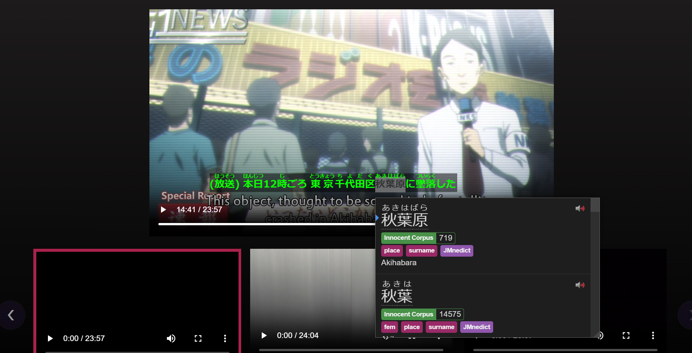
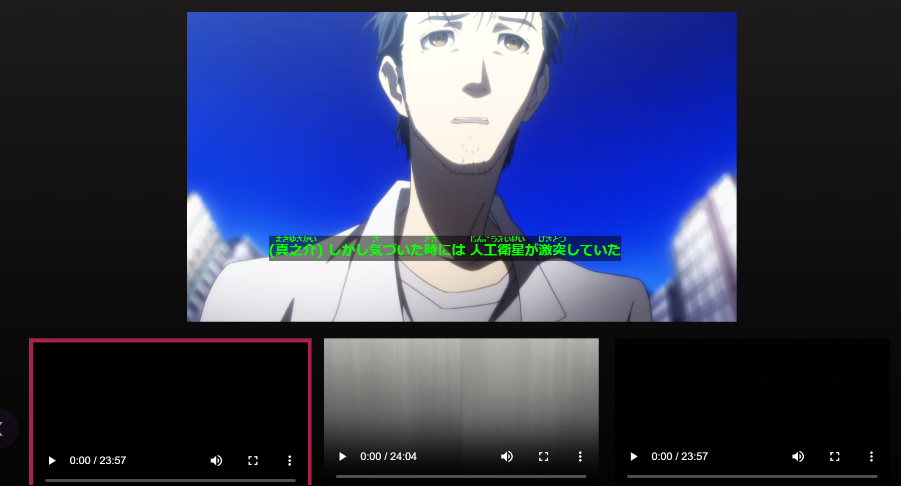

This is a [Next.js](https://nextjs.org/) project bootstrapped with [`create-next-app`](https://github.com/vercel/next.js/tree/canary/packages/create-next-app). 

This project is intended for active Japanese learners. One of the most effective ways to learn the language is by watching movies with subtitles in the target language. Problem with Japanese movies (that this project is meant to resolve) is that rare Japanese movie has subtitles available and even more rare ones with furigana subtitles (which helps beginners to learn the language). There ways to generate subtitles automatically from the audio stream with AI (by using for example whisper.cpp project). Furigana is enabled by Kuroshiro libraries asynchronously while video is playing. Examples of the final project's running are below. More advanced features are coming later. Like subtitle generation in background, automatic vacabulary generation and flash cards, video uploading and authentication.




## Getting Started

First, run the development server:

```bash
npm run dev
# or
yarn dev
# or
pnpm dev
```

Open [http://localhost:3000](http://localhost:3000) with your browser to see the result.

